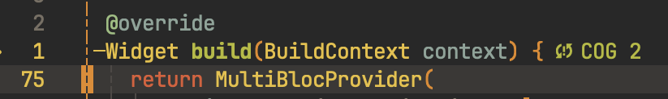

# treesitter_cyclomatic_complexity

[](https://github.com/Hecatoncheir/treesitter_cyclomatic_complexity/actions/workflows/ci.yml)
[](https://neovim.io)
[](LICENSE)

Cyclomatic and cognitive complexity for Neovim, computed entirely from
tree-sitter. Pure Lua, no external binaries, no LSP.

Complexity is shown as end-of-line virtual text on each function's signature,
coloured by how bad it is:



**Languages: Go, Dart, Lua and Python.** Adding another is a query file, not
code — see [doc/ADDING-A-LANGUAGE.md](doc/ADDING-A-LANGUAGE.md), which walks the
whole job command by command, and [doc/CONTRACT.md](doc/CONTRACT.md) for the
capture vocabulary.

## Why this can be trusted

Cyclomatic complexity is a purely syntactic metric, which is exactly what a
parse tree can answer. Rather than assert that, the numbers are checked against
each language's established tool over a real corpus:

| Language | Metric | Reference | Corpus | Agreement |
| --- | --- | --- | --- | --- |
| Go | Cyclomatic | `gocyclo` | Go standard library | **1620 / 1620 exact** |
| Go | Cognitive | `gocognit` | Go standard library | **1106 / 1118 exact** |
| Lua | Cyclomatic | `luacheck` | Neovim runtime | **911 / 917 exact** |
| Python | Cyclomatic | `radon` | Python standard library | **2134 / 2138 exact** |
| Dart | Cyclomatic | `dart_code_metrics` | 17 isolated constructs | **13 / 17 agree** |

All 12 Go cognitive differences are recursion, which `gocognit` charges a point
for and this plugin does not — see [Limitations](#limitations). The Lua figure
is measured in `nested_functions = 'separate'`, which is the model luacheck
uses.

All four Python differences are `assert`: radon counts the statement but does
not descend into its condition, scoring `assert a and b` the same as
`assert a` — while counting that same `and` in an `if` or a `return`. The
operator is counted here, which is the only reading consistent across the three
contexts.

Dart deserves its own sentence, because 13 of 17 is the honest number and it
understates the case. `dart_code_metrics` is the only Dart complexity tool still
runnable, it was sunset in 2023, and on the four constructs where it disagrees
it is demonstrably the one in error:

| Construct | It says | This plugin | Corroboration |
| --- | --- | --- | --- |
| `do { } while (c)` | 1 | 2 | `luacheck` scores Lua's `repeat…until` 2 |
| `switch` with 2 cases | 1 | 3 | `gocyclo` scores the same switch in Go 3 |
| `switch` with 3 cases | 1 | 4 | `gocyclo` scores it 4 |
| `sync*` with `yield` | 3 | 2 | a suspension point is not a branch |

So it finds no decision at all in a three-way switch, and does not count a
do-while loop. Every one of those calls also contradicts `gocyclo` and
`luacheck` on the equivalent construct, which is what settles them. The
constructs and their provenance are pinned in
`tests/fixtures/dart/constructs.dart`. Dart 3 pattern switches have no reference
at all — the tool predates them.

## Install

lazy.nvim:

```lua
{
  'Hecatoncheir/treesitter_cyclomatic_complexity',
  main = 'cyclomatic',
  event = { 'BufReadPost', 'BufNewFile' },
  opts = {},
}
```

`main = 'cyclomatic'` is required — the Lua module name differs from the repo
name. Needs Neovim 0.11+ and a tree-sitter parser for the language you are
editing (`go`, `dart`, `python`; Lua's is bundled with Neovim). Neovim 0.10
loads only tree-sitter ABI 13-14, which current grammars have outgrown.

## Configuration

Defaults, all optional:

```lua
opts = {
  -- Which metric drives the virtual text: 'cyclomatic' or 'cognitive'.
  metric = 'cyclomatic',

  -- 'inline'   closures count toward the enclosing function (what gocyclo does)
  -- 'separate' every closure is reported on its own
  nested_functions = 'inline',

  -- Colour buckets: <=low green, <=medium yellow, <=high red, above that bold red.
  thresholds = { low = 5, medium = 10, high = 20 },

  virtual_text = {
    enabled = true,
    min_complexity = 4,   -- leave trivial functions unannotated
    prefix = '󰓧',      -- needs a Nerd Font; '●' renders in almost any font
    -- Text between the prefix and the number. See below.
    label = { cyclomatic = 'CC', cognitive = 'COG' },
    -- Only needed to change the *shape* of the annotation; `prefix` and
    -- `label` cover its wording.
    format = function(entry, cfg)
      -- default: prefix, label and number, joined by spaces, empties dropped
    end,
    position = 'eol',
    priority = 100,
  },

  -- Off by default. Turning this on routes complexity into Trouble, the
  -- quickfix list, the statuscolumn and ]d for free.
  diagnostics = { enabled = false, min_complexity = 11 },

  events = { 'BufReadPost', 'BufWritePost', 'TextChanged', 'InsertLeave' },
  debounce = 250,

  filetypes = nil,          -- nil = every language that has a query
  exclude_filetypes = {},
  max_filesize = 512 * 1024,
}
```

### Wording

`prefix` and `label` are the two knobs for what the annotation says:

```lua
virtual_text = { prefix = '', label = 'complexity' }      --  complexity 14
virtual_text = { prefix = '●', label = '' }               --  ● 14
virtual_text = { label = { cyclomatic = 'Cyc' } }         --  󰓧 Cyc 14
```

The default prefix is a Nerd Font glyph. If yours is not a patched font it will
render as a placeholder box — set `prefix = '●'`, which almost any font has.

`label` is a table because `:Cyclomatic metric` switches metrics while the
annotations are on screen, and a single fixed string would start lying the
moment it was flipped. Passing a plain string is allowed and applies to both.
Overriding one metric leaves the other at its default.

Reach for `format` only when you want a different shape entirely — it receives
the entry (`name`, `cyclomatic`, `cognitive`, …) and the resolved config, and
returns the string to draw.

### Colours

Four highlight groups, linked to the `Diagnostic*` groups by default so they
follow your colorscheme. Override any of them:

```lua
vim.api.nvim_set_hl(0, 'CyclomaticLow', { fg = '#6f7d68' })
vim.api.nvim_set_hl(0, 'CyclomaticMedium', { fg = '#d8a657' })
vim.api.nvim_set_hl(0, 'CyclomaticHigh', { fg = '#ea6962' })
vim.api.nvim_set_hl(0, 'CyclomaticVeryHigh', { fg = '#ea6962', bold = true })
```

## Commands

| Command | Effect |
| --- | --- |
| `:Cyclomatic` | toggle annotations |
| `:Cyclomatic enable` / `disable` | ... explicitly |
| `:Cyclomatic refresh` | recompute the current buffer |
| `:Cyclomatic metric [cyclomatic\|cognitive]` | switch metric, or flip it with no argument |
| `:Cyclomatic list` | functions in this buffer, most complex first |
| `:Cyclomatic project [root]` | same across the project (async) |
| `:Cyclomatic explain` | account for the score under the cursor, point by point |
| `:Cyclomatic scaffold [lang]` | draft a `cyclomatic.scm` from the current buffer |
| `:Cyclomatic info` | language, support status, score at the cursor |
| `:Cyclomatic reload` | re-read query files after editing one |

`list` and `project` use `snacks.picker` when it is installed and fall back to
the quickfix list otherwise.

### Explaining a score

A number is not much use when it looks wrong: you cannot tell a disagreement
about the rules from a bug in the query without seeing what was counted.
`:Cyclomatic explain` shows the account:

```
mixed  --  cyclomatic 6, cognitive 7

  line     cc    cog  what                     source
  ---------------------------------------------------------------
     3     +1         function baseline        func mixed(a, b, c ..
     4     +1     +1  branch                   if a && b && c {
     4     +1      -  operator                 if a && b && c {
     4     +1      -  operator                 if a && b && c {
     4            +1  operator run             if a && b && c {
     5     +1     +2  branch, nested 1 deep    for i := 0; i < n; ..
```

Operators show `-` in the cognitive column because the cost of a run is settled
only once every operator in it is known — `a && b && c` is two paths but one
thing to read — so the run is listed on its own line. The suite checks that the
account reconciles with the score for every function in every fixture, in both
nesting modes.

## lualine

```lua
sections = { lualine_x = { require('cyclomatic.lualine') } }
```

Shows the complexity of the function under the cursor, coloured by the same
buckets.

## API

```lua
local cc = require('cyclomatic')

cc.get(bufnr)        -- full analysis: { lang, entries, file_level }
cc.current()         -- entry under the cursor, or nil
cc.supported(bufnr)  -- is there a query for this buffer's language?
cc.refresh(bufnr)
cc.toggle(bufnr)     -- omit bufnr for global
```

Each entry is `{ name, row, end_row, cyclomatic, cognitive, nested }`, with
0-indexed rows.

## What counts

Cyclomatic complexity starts at 1 per function and adds one for each `if`,
`else if`, loop, non-default `case`, `catch`/`on` handler, ternary, and each
`&&`, `||` or `??`. A plain `else` and a `default:` add nothing — they
introduce no independent path. This is gocyclo's rule set exactly.

Cognitive complexity follows SonarSource: branches cost more the deeper they
are nested, `else` costs a flat point, and a run of the same boolean operator
costs one point rather than one per operator.

Full rules, and the capture vocabulary that expresses them, are in
[doc/CONTRACT.md](doc/CONTRACT.md).

## Adding a language

Write `queries/<lang>/cyclomatic.scm`. No Lua changes are needed — Neovim finds
the file by runtimepath, which also means you can override the shipped rules by
putting your own version in `~/.config/nvim/queries/<lang>/cyclomatic.scm`.

[doc/ADDING-A-LANGUAGE.md](doc/ADDING-A-LANGUAGE.md) opens with a quickstart
that does the whole job on Python, command by command. In short, start by
letting the plugin read the grammar for you:

```bash
nvim --headless -l scripts/scaffold-query.lua rust sample1.rs sample2.rs
```

The draft it emits is always valid query syntax, names the shapes that fail
silently, and lists the constructs your samples never exercised. On Go's own
fixtures the unedited draft scores 100% against gocyclo across 1619
standard-library functions.

[doc/ADDING-A-LANGUAGE.md](doc/ADDING-A-LANGUAGE.md) walks through the whole
process on Lua, including the place where the obvious reading of the grammar was
wrong and the traps that fail silently rather than erroring.

## Tests

The suite needs nothing but Neovim and the two tree-sitter parsers. Build the
parsers once, then run it:

```bash
scripts/install-parsers.sh
```

```bash
nvim --headless -u NONE --cmd "set rtp+=$PWD/.ci/parsers" -l tests/run.lua
```

With the parsers already on your runtimepath, `nvim --headless -l tests/run.lua`
is enough. Pass a name to run a subset — `... -l tests/run.lua analyzer`.

Cases live in `tests/spec/`. Fixture expectations live beside the code they
describe, as `EXPECT <name> cc=<n> cog=<n>` comments, and the Go numbers are the
values gocyclo and gocognit produce for those same files. That claim is itself
checked, so the suite cannot drift into asserting only its own past output:

```bash
scripts/check-reference.py
```

CI runs the suite against Neovim 0.11, stable and nightly, plus stylua,
luacheck, and the reference check above. Grammars are pinned by revision in
`scripts/install-parsers.sh` — a grammar change has to break CI visibly rather
than quietly altering everyone's numbers.

## Releasing

Tagging `vX.Y.Z` builds a GitHub release automatically. The notes come from the
matching `CHANGELOG.md` section, and a tag without one fails the workflow before
anything is published:

```bash
git tag v0.1.0 && git push origin v0.1.0
```

## Documentation

`:help cyclomatic` covers configuration, commands, highlight groups and the API
from inside the editor. In the repository,
[doc/ADDING-A-LANGUAGE.md](doc/ADDING-A-LANGUAGE.md) walks through adding a
language and [doc/CONTRACT.md](doc/CONTRACT.md) documents the capture
vocabulary.

## Troubleshooting

```vim
:checkhealth cyclomatic
```

Most of what goes wrong here is not the plugin's own doing — a parser that is
missing, or one built against a tree-sitter ABI the running Neovim cannot load,
or a grammar whose node names have moved. All three used to surface as the same
unhelpful `no cyclomatic query for <lang>`, several steps from the cause. The
health check names them apart:

```
cyclomatic.nvim: languages ~
- OK    go: parser and query both load
- ERROR dart: parser found, but its ABI is not loadable by this Neovim
  - ABI version mismatch for .../parser/dart.so: supported between 13 and 14, found 15
  - Rebuild the parser, or run a newer Neovim.
- WARN  zig: no parser installed
```

It also validates the configuration — an invalid `metric` used to surface as
`attempt to compare number with nil` from the renderer — and lists which open
buffers are being measured and which are not.

## Limitations

These are deliberate, and all of them follow from what a parse tree can and
cannot know:

- **Recursion is not counted.** SonarSource charges a point for a recursive
  call; detecting one needs symbol resolution, which tree-sitter does not do.
  Matching on the function's name instead is worse than not trying: it is
  exactly what makes `gocognit` report complexity 1 for
  `func (d dirEntryDirs) len() int { return len(d) }`, where the `len` being
  called is the builtin.
- **Declarations without a body are skipped**, such as Go's `//go:linkname`
  forward declarations. There is no code to measure.
- **Dart wildcard switch arms are counted.** In a Dart 3 pattern switch, `_ =>`
  is a `switch_expression_case` like any other, so unlike a `default:` clause it
  cannot be excluded structurally.
- **Macro bodies are opaque.** Branches generated inside a macro are invisible;
  this matters for Rust and C, not for Go or Dart.
- **Only the root language of a buffer is analyzed** — injected languages, such
  as SQL inside a string, are not.

## License

MIT
